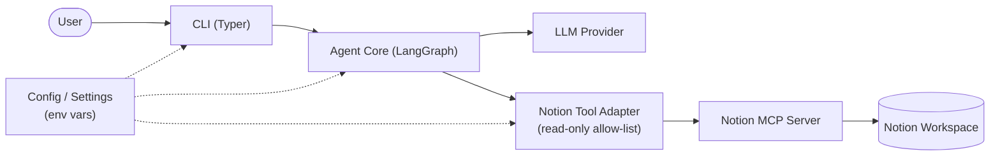
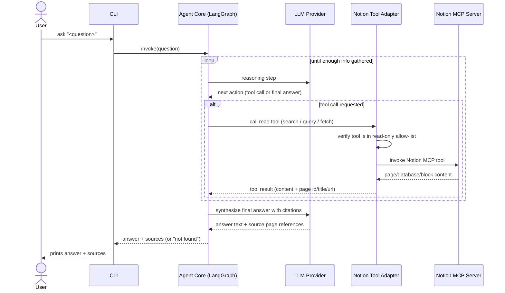

# SecondBrain — Architecture

## Component Diagram

## Sequence Diagram

## Design Decisions

- **LangGraph over LangChain/CrewAI.** The agent is a single reasoning loop (ReAct-style:
  decide a tool call, observe, repeat, then answer) with no need for multiple cooperating
  agents. LangGraph gives explicit control over that loop and makes it straightforward to
  enforce the read-only tool allow-list at a graph node, rather than relying on the LLM
  to only pick "safe" tools.
- **No RAG / embeddings / vector store.** Notion MCP already exposes live search and query
  tools over the workspace. Indexing content separately would introduce staleness, storage,
  and sync-cost problems the spec's non-goals explicitly rule out. The agent always reads
  Notion live, at query time.
- **Read-only enforcement in the adapter, not just the prompt.** The Notion Tool Adapter
  holds an explicit allow-list of permitted MCP tool names (search, fetch page, query
  database, retrieve block children, list pages). Any tool call outside that allow-list is
  rejected before reaching the MCP server, so a prompt-injected or hallucinated write-tool
  call cannot execute even if the LLM attempts it.
- **Citations are structural, not incidental.** Every Notion Tool Adapter result carries the
  source page's id/title/url alongside its content. The final synthesis step is required to
  attach these to the answer, so citations are derived from actual retrieved data rather than
  generated from the LLM's memory.
- **Explicit "not found" path.** The agent's synthesis step is instructed to state when no
  retrieved content answers the question, instead of falling back to general knowledge. This
  directly satisfies the spec's Definition of Done and acceptance test 6.
- **CLI-only interface.** Matches the current phase scope (Phase 5 — CLI). A web/API surface
  is deferred; nothing in this architecture blocks adding one later, since the Agent Core is
  decoupled from the CLI.

## Component Responsibility Table

| Component | Responsibility |
|---|---|
| CLI (Typer) | Accepts a natural-language question from the user, invokes the Agent Core, renders the returned answer and source citations (or "not found") to the terminal. |
| Agent Core (LangGraph) | Orchestrates the reasoning loop: decides which Notion tool to call next, evaluates results, decides when enough information has been gathered, and produces the final cited answer. |
| Notion Tool Adapter | Exposes only allow-listed, read-only Notion MCP tools to the Agent Core; translates MCP tool schemas/results into a form the agent can consume, including page-level citation metadata. |
| LLM Provider | Performs the reasoning steps (tool selection) and the final answer synthesis. |
| Notion MCP Server (external) | Notion's own MCP server; executes the actual Notion API calls (search, page/database/block retrieval) against the workspace. |
| Config / Settings | Loads API keys, model configuration, and Notion MCP connection details from environment variables; no secrets committed to the repo. |
